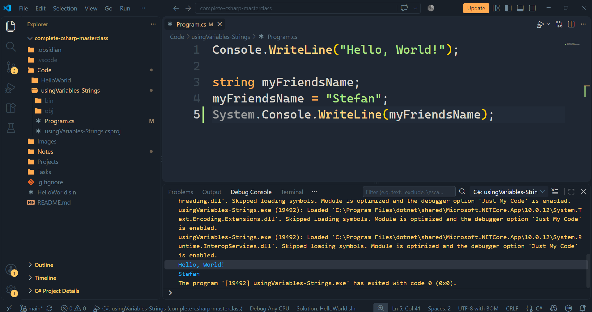
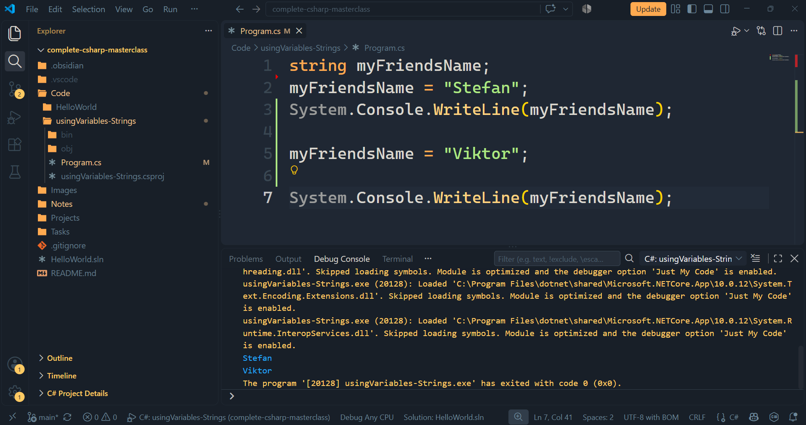

В тази лекция ще разберем как можем да декларираме променлива, как можем да присвоим стойност на променлива, как можем да презапишем тази променлива и как да получим достъп до нея.
Ще започнем се дефинирането на променлива.
Ще създадем променлива, която ще съдържа името на наш приятел.

> [!CODE] Деклариране на променлива
> ```csharp
> string myFriendsName;
> ```

По този начин ние `декларираме` променлива.
Това е променлива от тип данни `string`, което означава, че тя може да съдържа данни от тип `string`. 
След това ние можем да зададем стойност на тази променлива. Можем да кажем.

> [!CODE] Присвояване стойност на променлива
> ```csharp
> myFriendsName = "Stefan";
> ```

На нов ред ние използваме името на променливата, после знака равно и ѝ присвояваме стринг.
Как разбираме, че сме ѝ присвоили стринг? По къдравите кавички.
Така че ние започваме стринг с кавички и завършваме стринг с кавички. Затова трябва да оградим стринга с кавички, т.е. текста, който ние искаме да съхраним, така да се каже.
И така, това е мястото, където `присвояваме` стойност на променлива.
И всеки път ние завършваме с точка и запетая. Когато декларирахме променлива, завършихме с точка и запетая. Същото направихме и сега.
Сега ще се опитаме да достъпим променливата и ще го направим в конзолата.

> [!CODE] Достъпване на променлива в конзолата
> ```csharp
> System.Console.WriteLine(myFriendsName);
> ```

По този начин получаваме `достъп` до променливата.
Сега в конзолата ще се види това, което тази променлива представлява, т.е. текста, който тя държи в момента.



Виждаме, че се показва първо `Hello, World`, а после и `Stefan`.
Как сега да заменим това име?
Променливите в C# могат много лесно да бъдат презаписвани. Затова ние просто можем да кажем следното.

> [!CODE] Презаписване на променлива
> ```csharp
> myFriendsName = "Viktor";
> ```

Ако сега стартираме този код отново.



Сега виждаме новото име `Viktor`.
Променливите са много полезни. Те ни позволяват да съхраняваме променливи в паметта и да ги използваме повторно в нашия код.
Само за наша информация, ние можем да декларираме и зададем стойност на променлива и на един ред, например

> [!CODE] Деклариране и присвояване стойност на променлива на едн ред
> ```csharp
> string myFriendsName2 = "Plamen";
> ```

